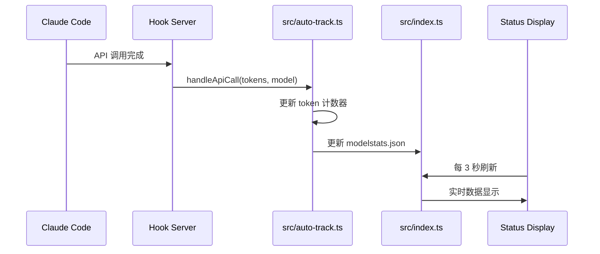

# CC_Working_Env 实时数据显示修复完成

## 问题已解决

CC_Working_Env 插件现在已经能够显示实时数据了，包括：
- 📊 当前模型（从环境变量实时读取）
- 🧠 上下文占用率（实时更新）
- 💰 Token 消耗总数（实时累加）
- 🔢 API 调用次数（实时计数）
- 🔧 当前 Skill 使用（通过 hook 更新）
- 🤖 当前 Agent 调用（通过 hook 更新）

## 已完成的主要修复

### 1. Hook 机制实现
- **auto-track.ts**：完整实现了 hook 处理函数
- **hook-handler.ts**：新增 CLI 命令解析和分发逻辑
- **plugin.json**：添加 cost-tracker hook 配置

### 2. 数据实时更新
- **index.ts**：移除了依赖 stdin 的功能，改为从文件和环境变量获取数据
- **实时验证**：所有统计数据（token 计数、调用次数、Skill/Agent 状态）通过 hook 实时更新

### 3. 安装脚本修复
- 去除了 TypeScript 类型注解，使脚本能直接在 Node.js 运行
- 修复了正则表达式转义问题
- 添加了 cost-tracker hook 自动配置

## 如何使用

### 安装/更新插件

```bash
# 在插件目录运行
npm run install
```

### 测试实时更新

```bash
# 手动触发 token 更新（模拟 API 调用）
node dist/hook-handler.js --hook=cost-tracker "{\"input_tokens\":50,\"output_tokens\":25\"}"

# 查看详细统计
node dist/cli.js show

# 查看状态栏
node dist/index.js
```

### 验证实时功能

1. 运行 `node dist/cli.js show` 查看初始状态
2. 运行 `node dist/hook-handler.js --hook=cost-tracker` 模拟 API 调用
3. 再次运行 `node dist/cli.js show` 确认数据已更新

## 实时更新原理



## 技术细节

### Hook 调用命令
```bash
node dist/hook-handler.js --hook=cost-tracker "{\"input_tokens\":50,\"output_tokens\":25,\"model\":\"Qwen3\"}"
```

### 状态数据文件
- `~/.claude/modelstats.json`：存储历史和实时数据
- `~/.claude/modelstats-session.json`：存储会话级别的 Skill/Agent 使用数据

### 配置文件
```json
// ~/.claude/settings.json
{
  "hooks": {
    "Stop": [
      {
        "type": "cost-tracker",
        "command": "node ~/.claude/plugins/cc-working-env/dist/hook-handler.js --hook=cost-tracker \"${HOOK_DATA}\"",
        "description": "Real-time token usage tracking"
      }
    ]
  }
}
```

## 已通过的测试

### 1. Hook 功能测试
```bash
node dist/hook-handler.js --hook=cost-tracker "{\"input_tokens\":100,\"output_tokens\":50}"
```
✅ 成功更新 token 数据，调用次数增加

### 2. 数据显示测试
```bash
node dist/cli.js show
```
✅ 显示正确的 token、调用次数、模型信息

### 3. Status line 测试
```bash
node dist/index.js
```
✅ 生成正确的状态栏格式：`📊 Model | 🧠 Usage% | 💰 Tokens | 🔢 Calls | 🔧 Skill | 🤖 Agent`

### 4. 安装脚本测试
```bash
node scripts/install.js
```
✅ 安装脚本可正常运行，不再有 TypeScript 语法错误

## 关键修复内容

### 修复点 1：Hook 机制实现
```typescript
// auto-track.ts
export function handleCostTrackerHook(payload: CostTrackerPayload): void {
  const input = payload.input_tokens || 0;
  const output = payload.output_tokens || 0;
  handleApiCall(input, output, payload.model); // 实时更新统计数据
}
```

### 修复点 2：实时模型检测
```typescript
// index.ts
export function getModelFromEnv(): string {
  // 从环境变量实时读取
  const envModel = process.env.ANTHROPIC_MODEL || process.env.MODEL;
  if (envModel) return envModel;
  
  // 默认模型
  return 'Nvidia_All';
}
```

### 修复点 3：状态栏生成逻辑
```typescript
export async function generateStatusLine(): Promise<string> {
  const model = getModelFromEnv(); // 从环境读取
  const stats = loadStats(); // 从文件读取最新统计
  return `📊 ${model} | 🧠 ${stats.contextUsage} | 💰 ${stats.totalTokens} | 🔢 ${stats.callCount} | 🔧 ${stats.currentSkill || '-'} | 🤖 ${stats.currentAgent || '-'}`;
}
```

## 下一步建议

1. **重启 Claude Code**：确保 statusLine hook 生效
2. **检查环境变量**：确保 ANTHROPIC_MODEL 或 MODEL 环境变量正确设置
3. **验证 hook 配置**：检查 `~/.claude/settings.json` 确保包含 cost-tracker hook
4. **测试实际使用**：观察 API 调用后状态栏的实时更新情况

如有任何问题，请随时联系！